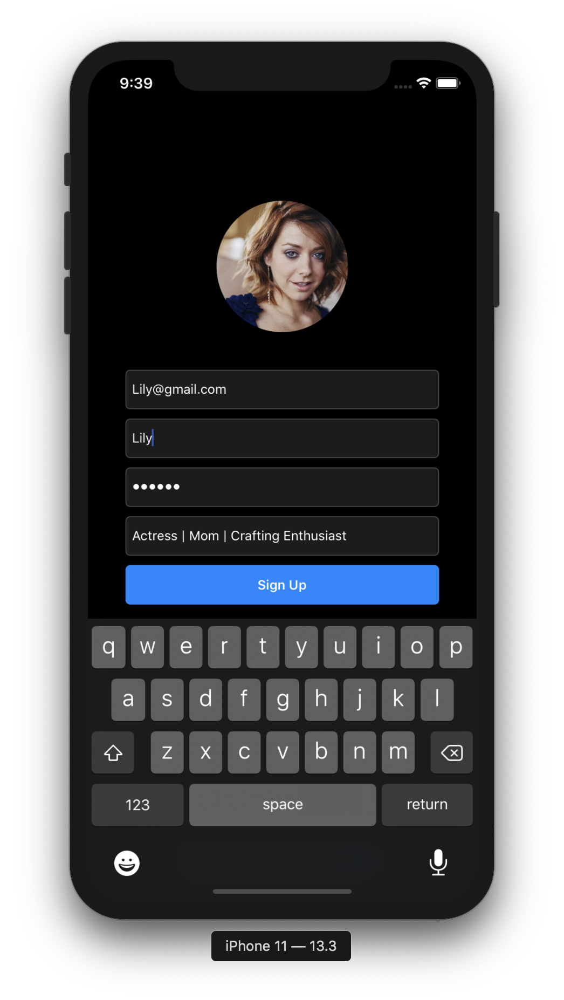
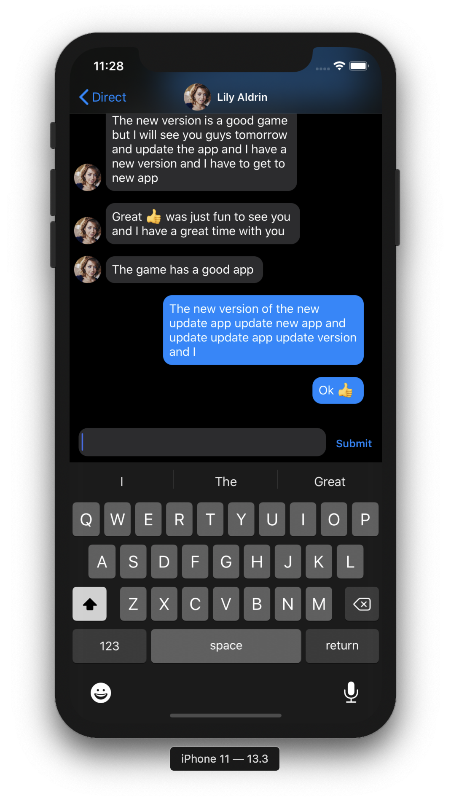

# Instagram_Clone

A clone of instagram iOS app created using Swift 5 and Firebase

# Login

|  |  | 
|:---:|:---:|

# Home Feed

# Dark and Light Mode

|  |  | 
|:---:|:---:|

# Profile Grid and List View

|  |  | 
|:---:|:---:|

# Custom Mosiac Image Picker

|  | | 
|:---:|:---:|

# Users Search and Adding Comments

|  |  | 
|:---:|:---:|

# DM and interactive keyboard (like iMessage app)

# performance
* Using pagination in homefeed and messages to reduce server cost
* implement infinite scrolling ( The app loads some initial data and then adds the rest of the information when the user reaches the bottom of the visible content) in home feed for better user experience
* prefetching the posts before they got displayed in the backgrourd threads reducing the catch mis by roughly 40%

