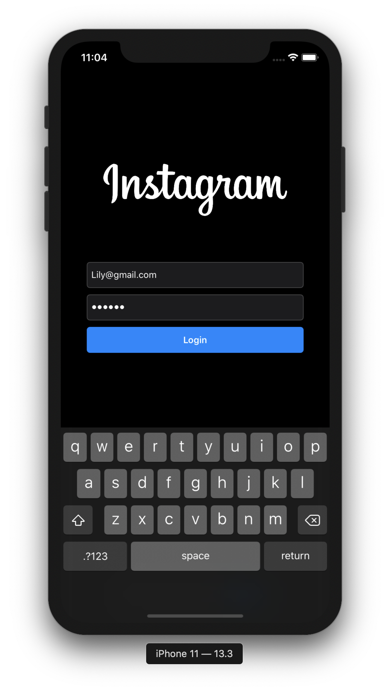
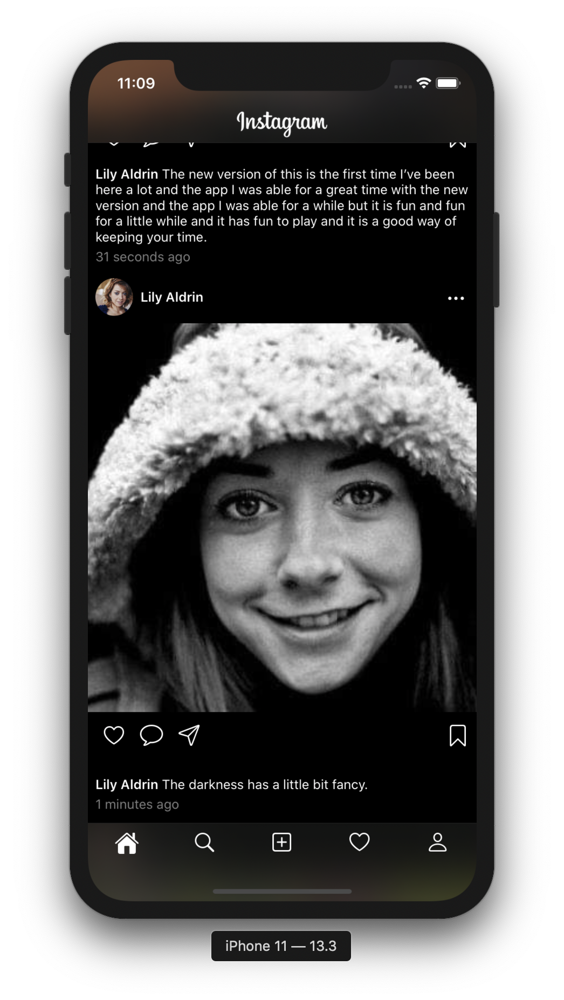
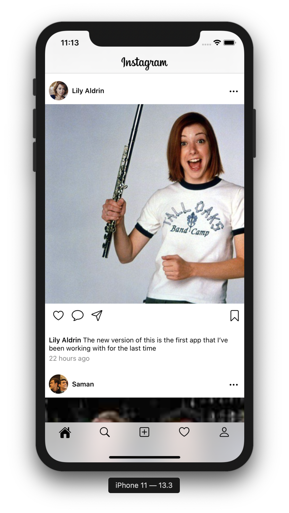
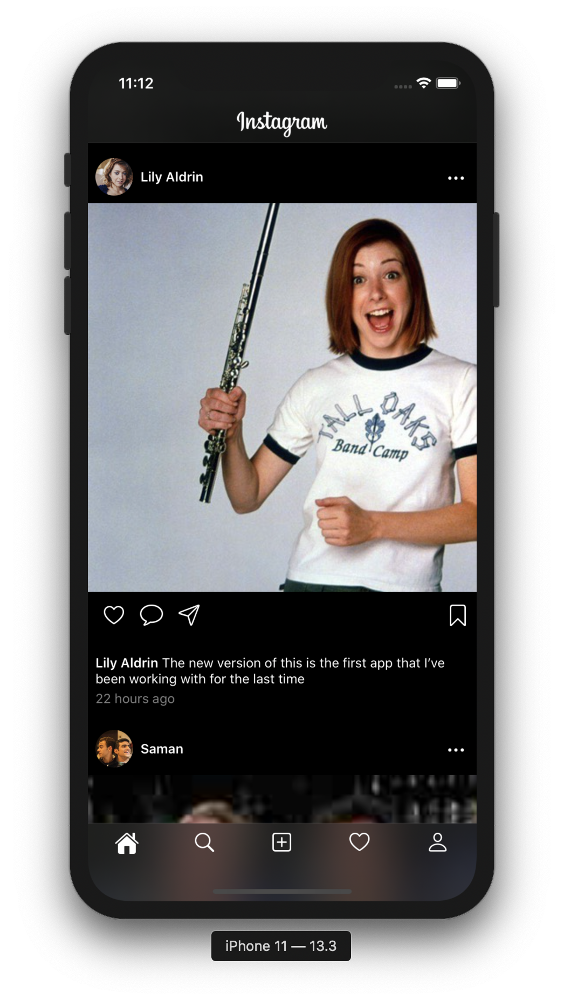
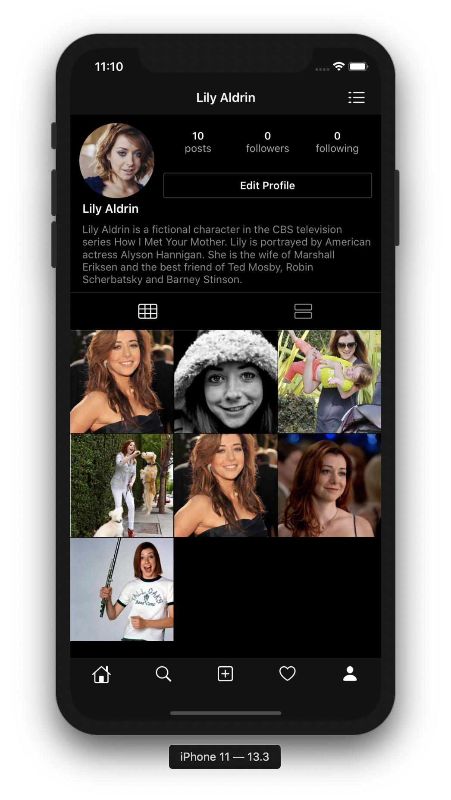
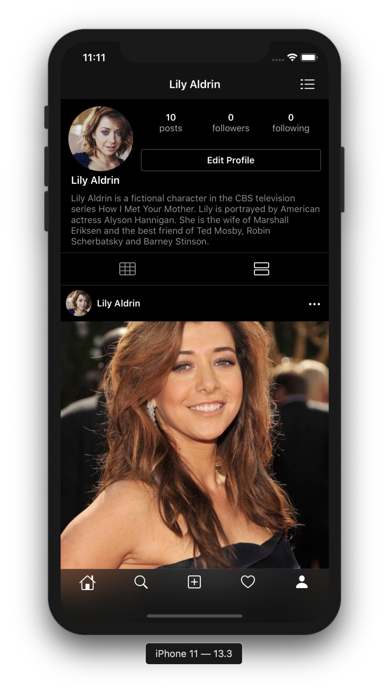
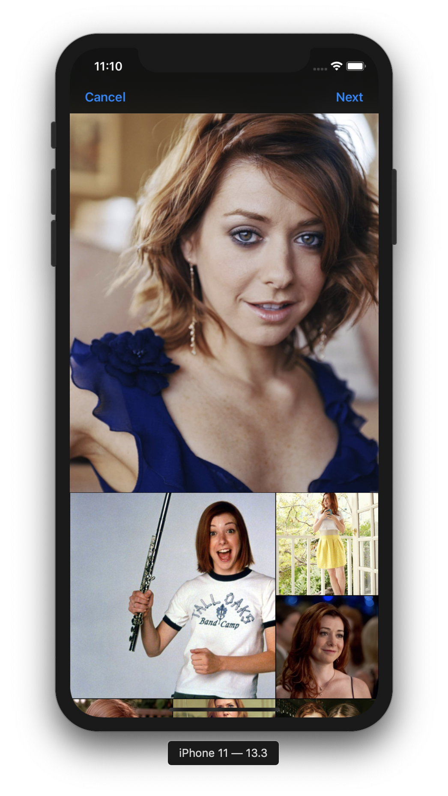
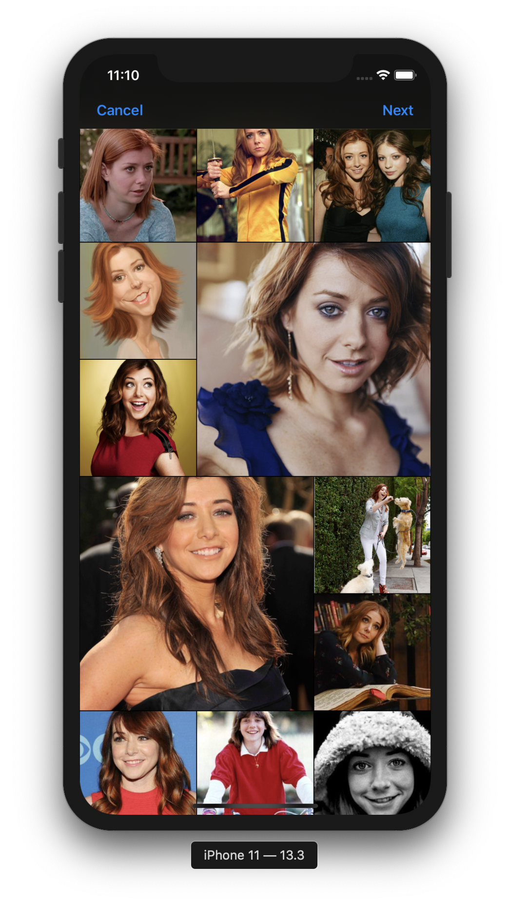
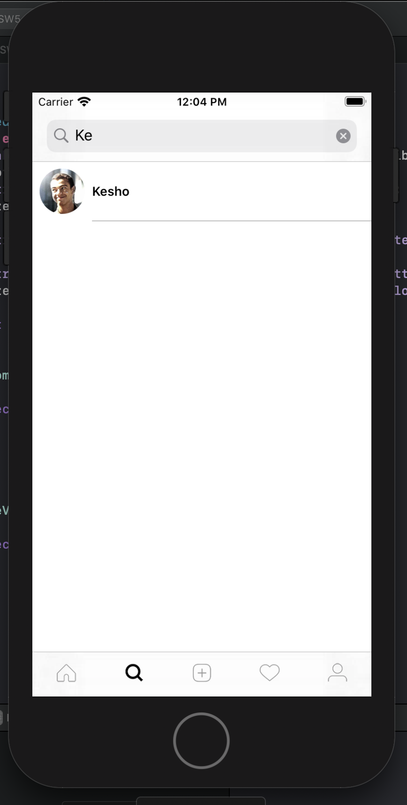
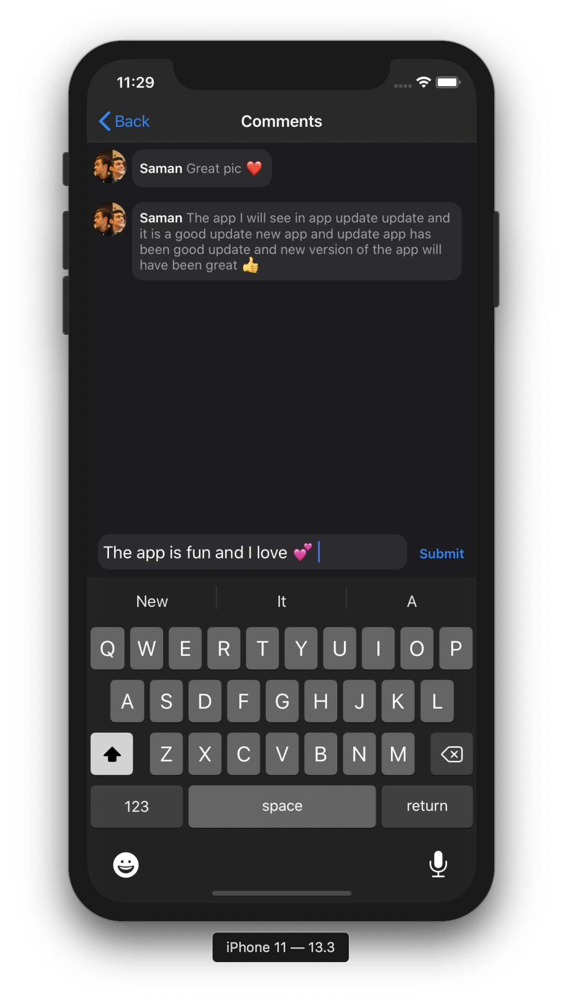

# Instagram_Clone

A clone of instagram iOS app created using Swift 5 and Firebase

# Login

# Home Feed

# Dark and Light Mode

|  |  | 
|:---:|:---:|

# Profile Grid and List View

|  |  | 
|:---:|:---:|

# Custom Mosiac Image Picker

|  |  | 
|:---:|:---:|

# Users Search and Adding Comments

|  |  | 
|:---:|:---:|

# Features
* Dark Mode
* Building Fancy custom UICollectionViewLayout with stretchy header from scratch
* prefetching "create operations in background to fetch Home Feed cells that about to display"
* Dynamic sizing Cells

# TODO
* Perform delete post
* Implement Chat 
* Implement Home Feed Pagination queries
* Use diffable data source API introduced in iOS 13 in Search Controller
* Implement Stories

